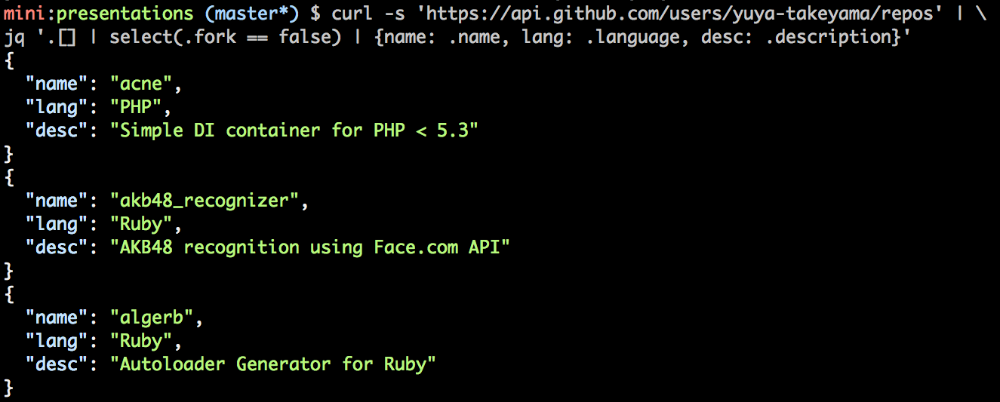

% jr: jq alternative tool for Rubyists
% @yuya_takeyama
% 2015/08/22 YAPC::Asia Tokyo 2015

# こんにちは

* Ruby で作った自作コマンドの紹介です
* Perl の話ありません！すいません！！

# 自己紹介

* @yuya_takeyama
* KENT WEB というサイトで配布されていた Perl 製 CGI スクリプトの改造がプログラミングとの出会いでした
* Bulknews に憧れて ReadMe! Japan の RSS を配信するサイトとかやってました
* 赤坂で PHP 書いてます
* 9 月から京橋で Ruby とか書いてると思います

# [jq: commandline JSON processor](https://stedolan.github.io/jq/)

* sed/awk/grep for JSON
* Written in C

# [jq: commandline JSON processor](https://stedolan.github.io/jq/)

# [jr: jq alternative tool for Rubyists](https://github.com/yuya-takeyama/jr)

* sed/awk/grep for JSON
* Inspired by jq
* Written in Ruby

# [jr: jq alternative tool for Rubyists](https://github.com/yuya-takeyama/jr)

# Why I created jr?

* jq is great, and I'm lovin' it!
* But it's bit paiful to performe complex aggregation.
* Because it requires to understand jq specific syntax.
* It's like JavaScript, but it's not JavaScript.
* I want to write in Ruby!!!

# Writing jr filters

* Receive stream of JSONs
* Transform it using method-chaining
* Methods of Enumerable are very helpful

# Pros

* Great power of Ruby!
* Huge assets of further Rubygems!
* No additional knowledge required (for Rubyists)
* Hackable (Just a 116 lines of Ruby code at Ver. 0.2.0)

# Cons

* Bit redundant for easy task.
* Installation of Ruby is required.

# At the end

* Mr. Wall, Miyagawa-san, thank you for a wonderful encounter with programming
(And KENT-san of KENT Web too)
* Matsumoto-san, thank you for great power of Ruby
* @stedolan, the creator of jq, thank you for the inspiration
* Staffs of YAPC, thank you for great conference!

# Thank you for watching :)
