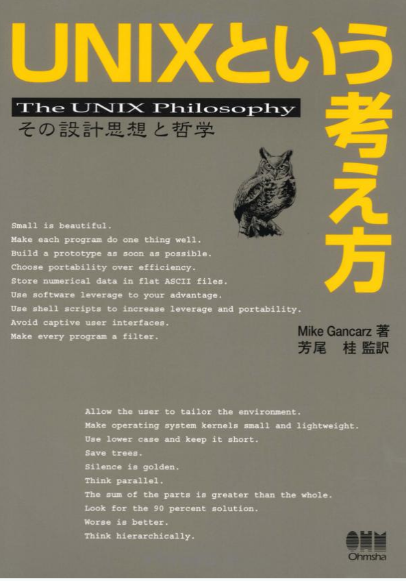

% Go and UNIX Philosophy
% @yuya_takeyama
% 2015/08/26 Kyobashi.go #1

# こんにちは

* @yuya_takeyama
* 赤坂で PHP 書いてます
* 失職まで三営業日
* 9 月から京橋で Ruby とか書いてると思います
* Go は主にコマンドラインツールを作るのに利用
* コマンドラインツールは Ruby でも書く (自作のイチオシは [jr](https://github.com/yuya-takeyama/jr))

# 今まで Go で作ってきたもの

* [ltsv2json](https://github.com/yuya-takeyama/ltsv2json): LTSV を入力として受け取り JSON として出力
* [hi](https://github.com/yuya-takeyama/hi): Web API の通信内容をターミナルに出力するプロキシ
* [numstat](https://github.com/yuya-takeyama/numstat): 入力の統計情報 (最小・最大・平均等) を出力
* [percentile](https://github.com/yuya-takeyama/percentile): 入力した数値のパーセンタイル値を出力
* などなど

# 今日話す内容

* Go でコマンドラインツールを書くモチベーション
* UNIX 哲学とは
* Go における UNIX 哲学

# 今日話さない内容

* Go の基本文法とかの説明
* Goroutine
* Channel

# 何故 Go で書くか

* コンパイルしてしまえばバイナリを置くだけで動く
    * Ruby 等の処理系をインストールする必要がない
    * 依存ライブラリをインストールする必要もない
* クロスコンパイルができる
    * Mac で開発して Linux で動かすのも簡単
    * Windows でも動かせる (個人的にはやったことないけど)

# その他 Go やってみて感じたこと

* シンプルであること、やり方が少ないことの良さ
    * Ruby/Perl みたいに TIMTOWTDI ではない
    * 継承も例外もイテレータもジェネレータもないジェネリクスもないけど
* 開発ツールが標準で充実しているので生産性が高い
    * go test / go fmt / go tool pprof
* 静的型付も悪くない、というかむしろ良い

# それでも Go を使わない場合

* 言語処理系自体の機能を使いたい場合
    * Ruby で言語内 DSL を実装したい場合
    * JavaScript でプラグイン機構を実装したい場合
* Go 標準のデータ型がマッチしない場合
    * map が順序を持ってないと困る場合
    * JSON の操作も割と面倒

# UNIX 哲学とは

# UNIX 哲学とは

# マイク・ガンカーズの UNIX 哲学 (一部抜粋)

* 小さいものは美しい。
* 各プログラムが一つのことをうまくやるようにせよ。
* 全てのプログラムはフィルタとして振る舞うようにせよ。

# UNIX プログラムとは

~~~~
$ seq 100 | awk '$1 % 2 == 0' | tail
82
84
86
88
90
92
94
96
98
100
~~~~

# UNIX プログラムとは

* 小さなプログラムを組み合わせる
* プログラム同士はパイプでつなぐ
* パイプは UNIX における標準インターフェイス

# UNIX 哲学の普遍性

* プログラミングパラダイムを超えて
    * オブジェクト指向 (単一責任原則)
    * 関数型プログラミング (小さな関数を組み合わせていくスタイル)
* レイヤも超えて
    * マイクロサービスアーキテクチャ

# Go でも UNIX っぽいプログラミングがしたい！

# Go におけるパイプ

* `io.Reader` と `io.Writer`
* これが UNIX でいうパイプ、標準インターフェイス！
* GoCon2014 で Go 開発者の [Rob Pike 自身もそのように言っていたらしい](http://gihyo.jp/news/report/01/GoCon2014Autumn/0001?page=2)
    * (当日寝坊して実際には聞けていない)
* これらを使うと様々な関数・メソッドを組み合わせられる (`bufio`, `io/ioutil` 等)
* ファイルもネットワークソケットも `io.Reader` であり `io.Writer`

# `io.Reader` と `io.Writer`

~~~~ {.go}
type Reader interface {
        Read(p []byte) (n int, err error)
}
type Writer interface {
        Write(p []byte) (n int, err error)
}
~~~~

* シグネチャ的には同一っぽいが...
* `io.Reader` は (何かから) `p` に読み込んだデータを書き込んでそのバイト数を返す
* `io.Writer` は `p` で受け取ったデータを (何かに) 書き出してそのバイト数を返す

# Go で cat を実装してみる

* 画面に納める都合でエラー処理雑です
    * 参考にしないでください
* `io.Reader` がどのように使われているか、に着目してください
* `io.Copy()` の使い方だけ覚えておいてください

~~~~ {.go}
func Copy(dst Writer, src Reader) (written int64, err error)
~~~~

# Go で cat を実装してみる (1)

入力としてファイルをひとつを受け取る

~~~~ {.go}
import (
	"io"
	"os"
)

func main() {
	file, _ := os.Open(os.Args[1]) // io.Reader
	io.Copy(os.Stdout, file)
}
~~~~

# Go で cat を実装してみる (2)

入力としてファイルをふたつ受け取る

~~~~ {.go}
import (
	"io"
	"os"
)

func main() {
	file1, _ := os.Open(os.Args[1])        // io.Reader
	file2, _ := os.Open(os.Args[2])        // io.Reader
	reader := io.MultiReader(file1, file2) // io.Reader
	io.Copy(os.Stdout, reader)
}
~~~~

# Go で cat を実装してみる (3)

入力として標準入力または複数のファイルを受け取る

~~~~ {.go}
import (
	"io"
	"os"
	"github.com/yuya-takeyama/argf"
)

func main() {
	reader, _ := argf.Argf() // io.Reader
	io.Copy(os.Stdout, reader)
}
~~~~

# I/O を使ったプログラムのテスト

* `bytes.Buffer` 構造体を使うと便利
    * `io.Reader` であり `io.Writer` でもある
    * Ruby/Python における `StringIO` みたいなもの
* 標準入出力のスタブとして使える
* ...という話を [GoCon 2014 の LT でしていました](https://yuya-takeyama.github.io/presentations/2014/11/30/gocon_2014_autumn/)

# まとめ

* Go はコマンドラインツールを作るのに便利
* コマンドラインツールを作るときは UNIX 哲学を思い出そう
* Go においては `io.Reader` と `io.Writer` を活用しよう

# ありがとうございました
