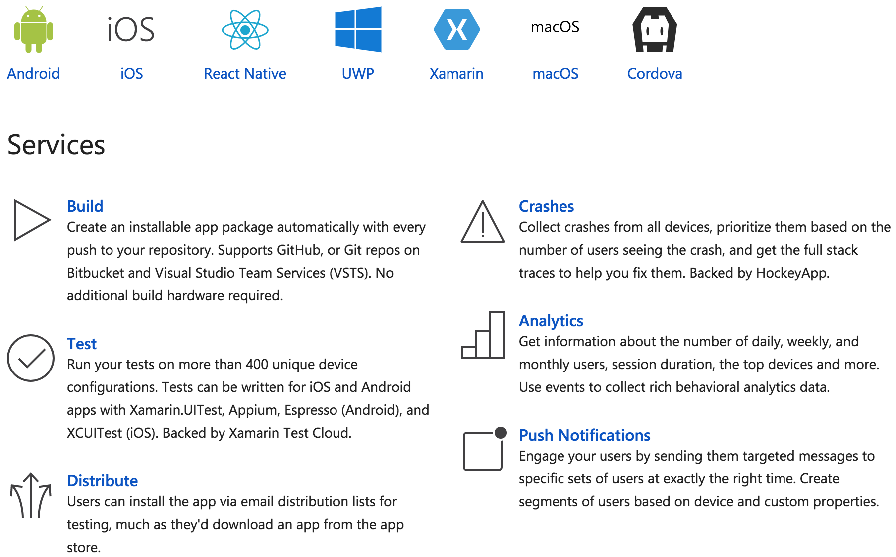
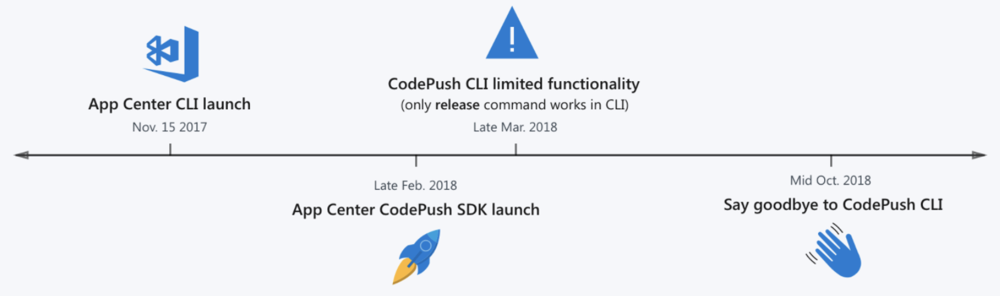
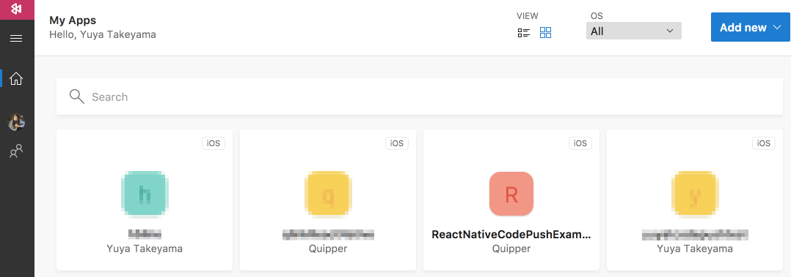
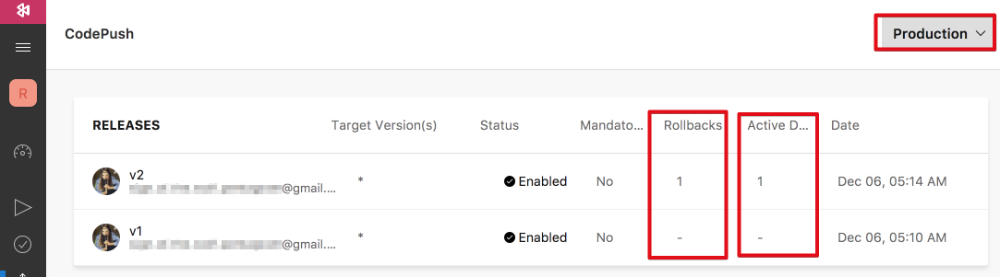
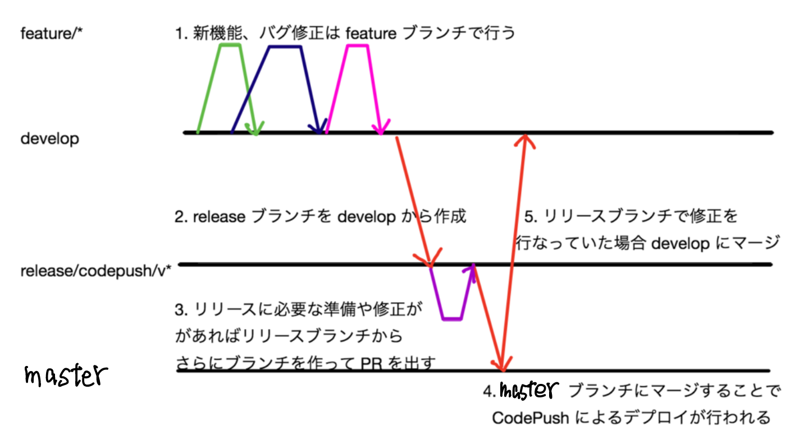
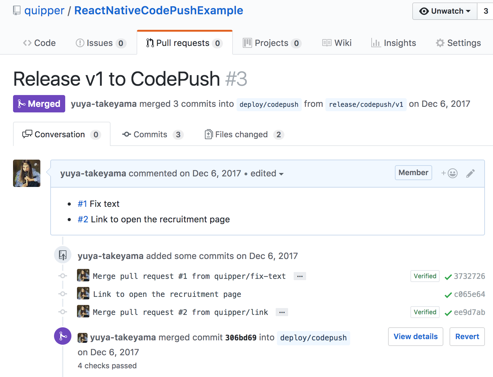

## Releasing React Native apps automatically with CodePush and CircleCI

---

## Release native apps like web! 🚀

---

## Hello

* GitHub: [@yuya-takeyama](https://github.com/yuya-takeyama)
* Web Developer at [Quipper](https://www.quipper.com/)
  * Ruby / TypeScript / Go
  * Basically, not a Mobile Developer

---

## What I talk today

* About our app
* What's CodePush
* How to setup CodePush
* How to automate releases

---

## About our app: StudySapuri for COACHES

---

## What's CodePush

* A cloud service to deploy mobiles apps written in React Native or Cordova directly to users
  * OTA (Over the Air)
* Hosted by Microsoft
* Available in Visual Studio App Center
  * https://appcenter.ms/
---

## OTA (Over the Air) in React Native

* Update JS Bundle throught HTTP
  * Fixing bugs
  * Tweaking styles
  * Adding new features are also be possible
* No need to wait for reviews by App Store
* Native Modules can't be updated via CodePush

---

## What's Visual Studio App Center

* MBaaS hosted by Microsoft
* Previously known as Mobile Center



---

## (Hopefully) It's been migrated softly!



https://microsoft.github.io/code-push/

---

## How to setup CodePush

* Details are available in our blog (in Japanese):
  * [Quipper での CodePush を使った OTA 配信とその自動化](http://quipper.hatenablog.com/entry/2017/12/06/060641)
* Source code example:
  * https://github.com/quipper/ReactNativeCodePushExample

---

## Steps to setup CodePush

Just follow the document! Not so difficult
https://docs.microsoft.com/en-us/appcenter/distribution/codepush/

1. CodePush-ify your app
2. Install the App Center CLI
3. Register your app to App Center
4. Release an update using `appcenter` command

---

## Setup react-native-code-push

```
$ yarn add react-native-code-push
```

```js
const codePushOptions = {
  checkFrequency: codePush.CheckFrequency.ON_APP_RESUME,
  installMode: codePush.InstallMode.ON_NEXT_RESUME,
};

export default codePush(codePushOptions)(AppComponent);
```

---

## appcenter-cli

```
# Global install
$ npm install -g appcenter-cli

# Project-local install
$ yarn add -D appcenter-cli
```
---



---



---

## Release! 🚀

```
$ appcenter codepush release-react \
    --app Quipper/AwesomeApp \
    --deployment-name Production
```

---

## Rollback 😞

```
$ appcenter codepush rollback \
    --app Quipper/AwesomeApp \
    --target-release=v9 \
    Production
```

---

## Automated release flow

[./.circleci/config.yml](https://github.com/quipper/ReactNativeCodePushExample/blob/develop/.circleci/config.yml)



---

## Create Release Pull Request

[./scripts/create_release_pull_request](https://github.com/quipper/ReactNativeCodePushExample/blob/develop/scripts/create_release_pull_request)

* Calculate next version number (e.g. v1 -> v2)
* Create a release branch from `develop` (e.g. `release/codepush/v2`)
* Create a Pull Request

---



---

## Recent Updates

* Build ipa using fastlane and deploy to DeployGate from CircleCI
* Staging deploy
  * Branch name starts with `staging-*` will be deployed to staging environment

---

# Thanks!

---

## Quipper is hiring React Native developers!

https://www.quipper.com/career/Japan/9/
